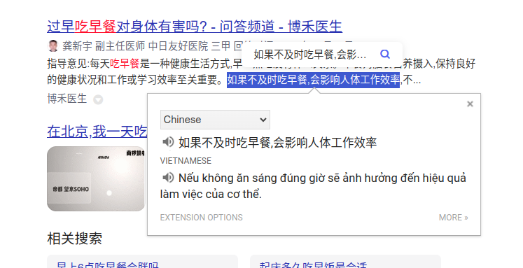
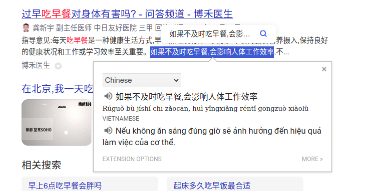

## Chrome Translate
Original version:
- https://chromewebstore.google.com/detail/google-translate/aapbdbdomjkkjkaonfhkkikfgjllcleb

Modifications:
- Change the maximum selected characters from 250 to 500.
- Reduce the font size of translate window from 18px to 15px.
- Add Pinyin when translating Chinese.
- Fix bug detect incorrect source language => cannot select to translate sometimes.
- Add key S for text-to-speech, Q/Esc for closing the translation.
- Support Pinyin for popup menu also.

Before

After

